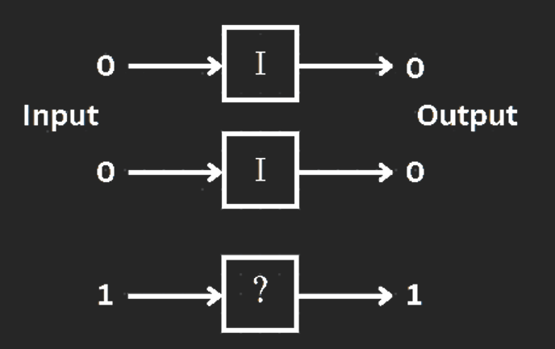

## Assignment 1

Construct a quantum circuit that gives a 50% probability of measuring 00 and 11 using the identity operator.

<!--  -->

References:

- https://github.com/pqcee/Quantum-courses/blob/main/lectures/chapter3.md
- https://qcve.org/blog/how-to-write-a-quantum-program-for-entangling-qubits
