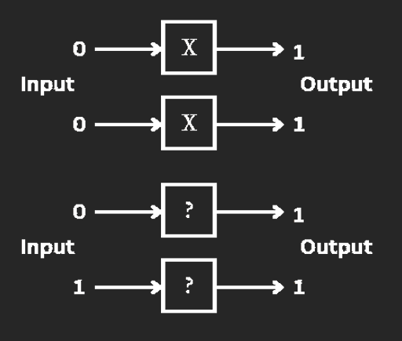

## Assignment 2

Using 'X' gates, construct the quantum circuit that returns 01 with 100.00% probability.

<!--  -->

[Internal](https://github.com/pqcee/Quantum-courses/blob/main/lectures/chapter4.md)
[External](https://quantum.microsoft.com/en-us/insights/education/concepts/single-qubit-gates)
