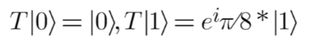
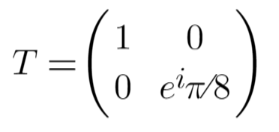

# Chapter 10: T gate: Phase shift π/8 
 
The T-gate is a unitary operator that introduces a phase shift of π/8 to a quantum state. When you apply the T-gate to a quantum state represented as vectors (|0⟩ and |1⟩), it has the following effect:

T-gate doesn't change the |0⟩ state, but it introduces a phase factor of e^(iπ/8) to the |1⟩ state. This phase shift is equivalent to a 22.5-degree rotation in the complex plane. 

Matrix representation:

*Note: The number of qubits required in the circuit for this gate is 1.*

The T-gate is often used in quantum algorithms for creating specific phase relationships, and it's particularly important in quantum error correction codes and quantum algorithms such as the Quantum Phase Estimation algorithm.

