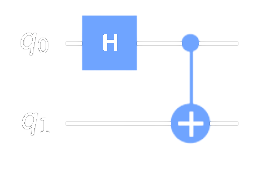

# Chapter 11: How to write quantum circuits in QuICScript

Now that you've learned about individual quantum gates, it's time to explore how they can be combined to create more complex quantum circuits. Just as a computer program is built by combining various commands and operations, quantum algorithms are constructed by chaining together quantum gates.

In quantum computing, each gate represents a specific operation on a qubit. To create a quantum algorithm, you'll arrange these gates in a sequence, much like lines of code in a program. The order in which you apply gates and the qubits they act upon significantly impact the outcome. Quantum gates can work in unison, creating intricate interplay between qubits and resulting in phenomena such as entanglement and superposition.

The language used to write the quantum program is “QuICScript” (Quantum Interpreted Circuits) where the BNF notation of QuIC quantum program is described in our FAQ. The use of QuIC allows for efficient description and execution of the quantum program which is important since we want to run the quantum program onchain.

For example, lets try to write the following Bell’s State circuit in QuICScript:

The operations performed on the first column are in depth 1, operations performed in the 2nd column are in depth 2, and so on...

1.	Organize Operations in Depth 1: Start by listing all the operations in the first depth. These operations are applied to the qubits from left to right. For example, if you have operations like Hadamard (H) and Identity (I) gates in the first depth, combine them in order. In the case of the Bell state, it's "HI" because you apply Hadamard to the first qubit and Identity to the second.
2.	Separate Depths with Commas: After noting down the operations in depth 1, add a comma to separate different depths. This helps maintain clarity and structure. Following the Bell state example, you'd write "HI," to indicate the completion of depth 1 operations.
3.	Repeat for Subsequent Depths: Continue the process for operations in the next depths. List all operations within each depth together, and add a comma after each depth. In the Bell state example, the next depth operation is the Control-Not (CN) gate. So, you add it after a comma to the Quick circuit, resulting in "HI,CN."
4.	Complete with a Period: To signal the end of your circuit description, finish with a period. In the case of the Bell state, you'd complete the circuit as "HI,CN."
