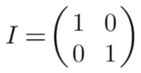
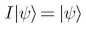
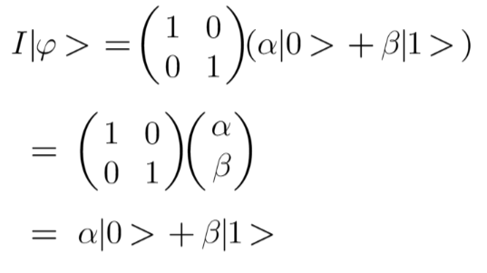

# Chapter 3: The Identity gate ( I )

The simplest possible quantum gate is the 2 x 2 identity gate and it semantically corresponds to the behavior of the identity gate in classical computing. The Identity gate is like the "do nothing" gate, it doesn't change the qubit at all. Imagine if you had a magic spell that said, "Stay the same!" That's what the Identity gate does.

Given that it is two dimensional, in linear algebra it is often denoted with 'I2,' while in quantum mechanics it is sometimes marked as '1.' In quantum computing, however, we normally just use the letter 'I' to represent the identity gate. Mathematically it can be expressed using the matrix below:

In essence, the linear transformation corresponding to the identity matrix can be viewed as an identity function. It is a type of function whose output is the same as its input. We can write it in the following way:

This is what happens when we apply it to a qubit:

When the identity gate is applied, the qubit state is left unchanged. The number of qubits required in the above circuit is '1'.
The number of qubits required in the circuit for this gate is '1.'

Exercise: Assignment 1
