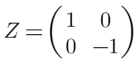
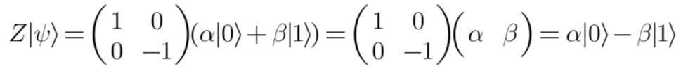

# Chapter 5: The Pauli-Z gate 
 
In QuICScript, we use the letter 'Z' to represent the Pauli-Z gate. The Z-gate is called the phase flip gate. Mathematically, it can be expressed using the matrix below:

Pauli-Z gate flips the sign of the qubit:

We started with a state of (α|0⟩ + β|1⟩)  and ended with a state of (α|0⟩ - β|1⟩). The only difference being the sign. 

The change of the sign we encountered when applying the Pauli-Z gate has no impact on the classical probabilities. 

*Note: The number of qubits required in the circuit for this gate is 1.*

