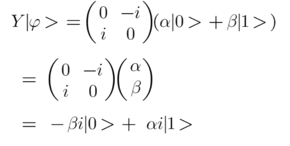

# Chapter 6: The Pauli-Y gate

The matrix representation of a Pauli Y gate applied to a single qubit is 

The Y-gate is both a bit flip gate and phase flip gate. It swaps the amplitudes and changes the sign at the same time for both |0⟩ and |1⟩.

_Note: The number of qubits required in the circuit for this gate is 1._

Exercise: Assignment 4
