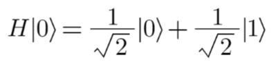
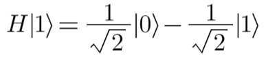

# Chapter 7: The Hadamard gate (H gate)

The Hadamard gate (H-gate) is a unitary operator in quantum computing that introduces a specific set of phase shifts to quantum states. When you apply the Hadamard gate to a quantum state represented as a ket vector (|0⟩ and |1⟩ basis states), it has the following effect:

The Hadamard gate transforms the |0⟩ state into an equal superposition of |0⟩ and |1⟩ and transforms the |1⟩ state into an equal superposition with a phase difference, effectively creating a quantum superposition.

When H is applied to |1⟩, it would be:

The matrix representation of a Hadamard gate applied to a single qubit is

The Hadamard gate is used in quantum computing to create superposition and manipulate quantum states for various quantum algorithms, including the Quantum Fourier Transform and Grover's algorithm.

Note: The number of qubits required in the circuit for this gate is 1.

Exercise: Assignment 5
