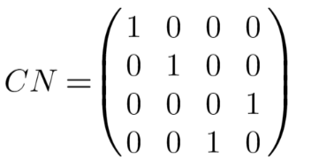

# Chapter 8: Controlled-Not Gate (CN) 
 
In QuICScript, the Controlled-NOT gate is denoted as CN. It is a two-qubit gate. This gate operates on a pair of qubits, where one is designated as the control qubit and the other as the target qubit.  When you apply the CNOT gate to a quantum state (|00⟩, |01⟩, |10⟩, |11⟩ basis states), it has the following effect:

- |00⟩ State: When the control qubit is in the |0⟩ state and the target qubit is also in the |0⟩ state, the CNOT gate leaves the state unchanged, resulting in |00⟩. 

- |01⟩ State: If the control qubit is in the |0⟩ state and the target qubit is in the |1⟩ state, the state remains |01⟩ after the CNOT gate is applied, as the control qubit is not in the state to trigger a change.

- |10⟩ State: In the case where the control qubit is in the |1⟩ state and the target qubit is in the |0⟩ state, the CNOT gate flips the target qubit. The resulting state becomes |11⟩.

- |11⟩ State: For the state where both qubits are in the |1⟩ state, the CNOT gate again flips the target qubit, changing the state to |10⟩.

Matrix representation:

*Note: The number of qubits required in the circuit for this gate is 2.*
