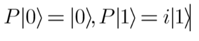
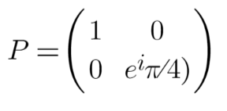

# Chapter 9: P gate: Phase shift π/4 
 
In QuICScript, the P-gate is denoted with the letter 'P.' It is known as the Phase gate or Phase shift π/4 gate. It performs a specific operation on a single qubit in a quantum circuit. When you apply the P gate to a quantum state represented as (|0⟩ and |1⟩), it has the following effect:

In simpler terms, the P gate leaves the |0⟩ state unchanged and introduces a phase shift of π/4 to the |1⟩ state (i.e., multiplying by the imaginary unit "i"). This is the Matrix representation:

*Note: The number of qubits required in the circuit for this gate is 1.*

The P gate is often used to introduce relative phase differences between the |0⟩ and |1⟩ states. The phase shift gate is used in quantum algorithms such as quantum phase estimation algorithm and the quantum Fourier transform.
